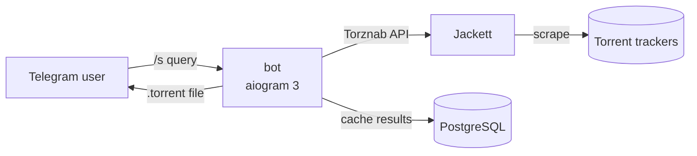

# tj-bot

Telegram bot for torrent search. Queries a self-hosted [Jackett](https://github.com/Jackett/Jackett) instance across all configured indexers, caches results in PostgreSQL and serves them as paginated cards with category filtering and one-tap `.torrent` download — right in the chat.

## Features

- **Full-text search** across every tracker configured in Jackett: `/s <query>`
- **Paginated result cards** — title, uploader, description, seeders/peers, size, category, publish date
- **Category filtering** of the result set via inline keyboard
- **`.torrent` download** delivered as a Telegram document
- **PostgreSQL-backed cache** — pagination and filtering never re-hit the trackers

## Architecture



Three containers orchestrated by Docker Compose on an internal bridge network:

| Service   | Image                 | Role                                        |
|-----------|-----------------------|---------------------------------------------|
| `bot`     | local multi-stage build | aiogram long-polling bot, non-root user   |
| `jackett` | `linuxserver/jackett` | Meta-search proxy over torrent indexers     |
| `db`      | `postgres:16`         | Result cache and query state                |

The bot reads the Jackett API key directly from the shared `ServerConfig.json` volume — no duplicated secrets.

## Requirements

- Docker Engine with Compose v2
- A Telegram bot token from [@BotFather](https://t.me/BotFather)

## Quick start

```bash
git clone https://github.com/DarkAlioth/tj-bot.git && cd tj-bot
cp .env.example .env          # fill in the values
docker compose up -d jackett db
# open http://<host>:9117 and configure your indexers, then:
docker compose up -d --build bot
```

## Configuration

All settings are provided via `.env` (never committed):

| Variable            | Required | Description                                  |
|---------------------|----------|----------------------------------------------|
| `BOT_TOKEN`         | yes      | Telegram bot token                           |
| `ADMINS`            | yes      | Comma-separated admin user IDs               |
| `POSTGRES_USER`     | yes      | PostgreSQL user                              |
| `POSTGRES_PASSWORD` | yes      | PostgreSQL password                          |
| `POSTGRES_DB`       | yes      | PostgreSQL database name                     |
| `DB_HOST`           | yes      | PostgreSQL host (`db` inside compose)        |
| `DB_PORT`           | no       | PostgreSQL port, defaults to `5432`          |

## Development

Tooling: [uv](https://docs.astral.sh/uv/), ruff, mypy (strict), pytest, bandit, pip-audit. Python 3.13+.

```bash
uv sync                        # install runtime + dev dependencies
uv run pytest                  # tests with coverage gate (80%+)
uv run ruff check . && uv run ruff format --check .
uv run mypy                    # strict type checking
uv run bandit -c pyproject.toml -r . -ll
uv run pip-audit               # dependency vulnerability audit
```

Every push and pull request runs the same gates in CI (`.github/workflows/ci.yml`); `main` accepts changes only through pull requests with green checks.

## Roadmap

- Async database layer (SQLAlchemy 2 + Alembic migrations)
- Hardened Jackett client: request encoding, timeouts, size limits
- Send-to-server downloads via qBittorrent (admin only)
- Sorting, tracker filters, saved-search subscriptions, history and stats
- Automated deployment via self-hosted CI runner
